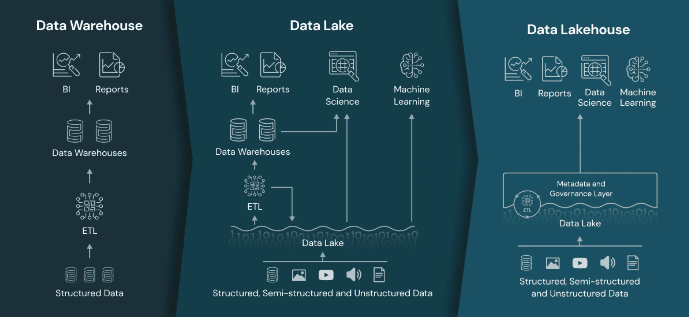

# Ders 3: Veri Depolama ve Akış Yönetimi

Bu derste, veri mühendisliğinde kullanılan veri depolama çözümleri ve veri akışı yönetimi üzerine odaklanacağız. Veri depolama sistemlerinin farklı türlerini öğrenecek ve gerçek zamanlı veri akışlarını nasıl yöneteceğimizi inceleyeceğiz. Ayrıca, her bölümde gerçek dünya örnekleri, kod örnekleri ve görsel açıklamalarla konuyu pekiştireceğiz.

## Ders 3a: Veri Depolama Çözümleri

### RDBMS: SQL ve Veri Modelleri

**RDBMS Nedir?**  
İlişkisel Veritabanı Yönetim Sistemleri (RDBMS), veriyi tablolar halinde organize eden ve SQL (Structured Query Language) kullanarak yönetilen veri tabanlarıdır. RDBMS, bankacılık, finans, perakende ve sağlık gibi sektörlerde yaygın olarak kullanılır.

**Örnek Senaryo:**  
Bir e-ticaret platformunda, müşteri bilgileri, siparişler ve ürün envanteri ilişkisel bir veritabanında saklanır. Bu veritabanında müşteri ID'si, sipariş ID'si gibi anahtarlar, farklı tablolar arasında ilişkiler kurar.

**Kod Örneği: SQL ile Veri Sorgulama**
```sql
SELECT orders.order_id, customers.customer_name, orders.total_amount
FROM orders
JOIN customers ON orders.customer_id = customers.customer_id
WHERE orders.order_date > '2024-01-01';
```

**Veri Modelleri ve Diyagramlar:**  
Veri modelleri, veritabanındaki tabloların nasıl organize edileceğini ve birbirleriyle nasıl ilişkili olduklarını gösterir. Bu modeller, Entity-Relationship (ER) diyagramları ile görselleştirilebilir.

### NoSQL: MongoDB ve Cassandra
**NoSQL Nedir?**  
NoSQL veritabanları, ilişkisel olmayan veri yapıları için kullanılan veritabanlarıdır. Bu veritabanları, esnek veri modellerine sahiptir ve özellikle büyük veri uygulamalarında kullanılır.

**Örnek Senaryo:**
Bir sosyal medya platformunda, kullanıcı profilleri, gönderiler ve beğeniler NoSQL veritabanında saklanır. Bu veritabanında, JSON formatında belirli bir kullanıcının tüm gönderileri veya beğenileri kolayca çekilebilir.

**Gerçek Dünya Uygulaması:**  
- MongoDB: Haber siteleri, sosyal medya platformları gibi yapılandırılmamış veya yarı yapılandırılmış verilerin hızla değiştiği ortamlarda tercih edilir.
- Cassandra: Yüksek veri yazma hızı gerektiren uygulamalar, örneğin IoT sensör verilerinin saklanması, Cassandra tarafından etkin bir şekilde yönetilebilir.

Kod Örneği: MongoDB ile Veri Ekleme
```python
from pymongo import MongoClient

client = MongoClient('mongodb://localhost:27017/')
db = client['ecommerce']
collection = db['products']

product = {
    "name": "Laptop",
    "price": 1200,
    "stock": 30,
    "categories": ["Electronics", "Computers"]
}

collection.insert_one(product)
```

## Veri Ambarı ve Veri Gölü Kavramları

**Veri Ambarı Nedir?**  
Veri ambarı, yapılandırılmış verilerin yüksek performanslı sorgular ve analizler için optimize edildiği, genellikle önceden işlenmiş ve organize edilmiş verilerin saklandığı bir veri deposudur. Veri ambarı, özellikle iş zekası (BI) ve raporlama için kullanılır.

**Veri Gölü Nedir?**  
Veri gölü, yapılandırılmış, yarı yapılandırılmış ve yapılandırılmamış verilerin ham, işlenmemiş formatta saklandığı büyük bir veri deposudur. Veri gölü, her türlü veriyi geniş ölçekte toplamak ve depolamak için esnek ve ölçeklenebilir bir altyapı sunar.



### Veri Ambarı ve Veri Gölü Örnek Senaryo

**Senaryo:**
Bir E-Ticaret platformunda, kullanıcı etkileşim verileri (tıklamalar, görüntülemeler), ürün envanteri ve sipariş verileri veri ambarında saklanır. Bu veriler, iş zekası raporları oluşturmak ve kullanıcı davranışlarını analiz etmek için kullanılır.

- **Veri Ambarı:** Tarihsel sipariş verileri, kullanıcı profilleri ve ürün envanteri gibi yapılandırılmış verileri saklar.
- **Veri Gölü:** Kullanıcı tıklamaları, görüntülemeleri gibi yapılandırılmamış verileri saklar. Bu veriler, büyük veri analitiği ve kişiselleştirilmiş öneriler oluşturmak için kullanılır.

|Özellikler| Veri Gölü | Veri Ambarı |
|---|-------------------------------------------------------------|---|
|Veri Türü| Yapılandırılmamış veya yarı yapılandırılmış veri (ham veri) | Yapılandırılmış veri (işlenmiş ve optimize edilmiş) |
|Veri Yönetimi| Veriler ham halde saklanır; daha az yapılandırılmış | Veriler ETL süreciyle işlenmiş ve düzenlenmiş |
|Kullanım Amacı| Veri analitiği, makine öğrenimi, veri bilim projeleri | İş zekası (BI), raporlama, veri analizi |
|Depolama Maliyeti| Genellikle daha düşük maliyetli | Genellikle daha yüksek maliyetli |
|Veri Saklama| Tüm veri türlerini saklayabilir; esnektir | Yalnızca belirli, işlenmiş veri saklar |
|Performans| Büyük veri hacmi için optimize edilmiştir; ancak ham veri nedeniyle yavaş olabilir | Yüksek performanslı sorgular için optimize edilmiştir |
|Esneklik| Yüksek; veriyi çeşitli amaçlarla kullanabilirsiniz | Düşük; genellikle belirli amaçlar için kullanılır |
|Veri İşleme| İşleme sonradan yapılır; veri bilimciler için esneklik sunar | Veri ambarına yüklemeden önce işlenir |
|Kullanıcılar| Veri bilimciler, analistler, geliştiriciler | İş analistleri, veri analistleri, BI uzmanları |

### Bulut Veri Depolama ve Veri Akışı

**Bulut Veri Depolama:**
Bulut veri depolama hizmetleri, verilerinizi güvenli bir şekilde depolamanıza ve yönetmenize olanak tanır. Amazon S3, Google Cloud Storage ve Azure Blob Storage gibi hizmetler, geniş veri depolama kapasitesi ve ölçeklenebilirlik sunar.
- **Amazon S3:** Büyük veri depolama ve dosya paylaşımı için popüler bir hizmettir.(Örneğin: S3 Standard, S3 Glacier)
- **Google Cloud Storage:** Yüksek performanslı ve düşük maliyetli veri depolama çözümü sunar.(Örneğin: Nearline, Coldline)
- **GCP BigQuery:** Google Cloud'un veri analizi ve sorgulama hizmetidir. (Veri Ambarı ve SQL sorguları için optimize edilmiştir)
- **AWS Redshift:** Amazon'un veri ambarı hizmetidir. (Yüksek performanslı SQL sorguları için optimize edilmiştir)

**Örnek Senaryo:**
AWS S3'te saklanan büyük veri setleri, Amazon Athena kullanılarak sorgulanabilir. Benzer şekilde, Google BigQuery'de saklanan veriler, SQL sorguları ile hızla analiz edilebilir.

---

## Ders 3b: Veri Akışı Yönetimi

### Apache Kafka ile Gerçek Zamanlı Veri Akışı
**Kafka Nedir?**  
Apache Kafka, dağıtık ve ölçeklenebilir bir mesajlaşma sistemidir. Kafka, özellikle büyük veri ve gerçek zamanlı veri akışı yönetiminde yaygın olarak kullanılır. Kafka'nın temel bileşenleri arasında brokerlar, konular (topics), üreticiler (producers) ve tüketiciler (consumers) yer alır.

**Örnek Senaryo:**  
Bir e-ticaret platformunda, kullanıcı etkileşim verileri (tıklamalar, görüntülemeler) Kafka üzerinden akış halinde tutulur. Bu veriler, gerçek zamanlı analizler, kişiselleştirilmiş öneriler ve hata izleme sistemleri için kullanılır.

**Kod Örneği: Kafka ile Mesaj Gönderme**
```python
from kafka import KafkaProducer

producer = KafkaProducer(bootstrap_servers='localhost:9092')
producer.send('finance', b'Stock price update: AAPL 150 USD')
producer.flush()
```

**Kod Örneği: Kafka ile Mesaj Okuma**
```python
from kafka import KafkaConsumer

consumer = KafkaConsumer('finance', bootstrap_servers='localhost:9092')
for message in consumer:
    print(message.value)
```

### Spark Streaming ile Veri İşleme
**Spark Streaming Nedir?**  
Apache Spark Streaming, gerçek zamanlı veri akışlarını mikropartiler halinde işleyen bir çerçevedir. Spark Streaming, büyük veri setleri üzerinde yüksek performanslı analizler yapmanızı sağlar.

**Kod Örneği: Spark Streaming ile Gerçek Zamanlı Veri İşleme**
```python
from pyspark import SparkContext
from pyspark.streaming import StreamingContext

sc = SparkContext("local[2]", "NetworkWordCount")
ssc = StreamingContext(sc, 1)

lines = ssc.socketTextStream("localhost", 9999)
words = lines.flatMap(lambda line: line.split(" "))
wordCounts = words.map(lambda word: (word, 1)).reduceByKey(lambda a, b: a + b)

wordCounts.pprint()
ssc.start()
ssc.awaitTermination()
```

**Gerçek Dünya Uygulaması:**
Bir sosyal medya platformunda, kullanıcı etkileşim verileri Spark Streaming ile işlenir ve anlık trendler, hashtag analizleri ve kullanıcı etkileşimleri gerçek zamanlı olarak takip edilir.

## Akış ve Toplu İşleme Arasındaki Farklar
- **Akış İşleme (Streaming Processing):** Veri akışlarını gerçek zamanlı olarak işler. (Örneğin: Apache Kafka, Spark Streaming)
- **Toplu İşleme (Batch Processing):** Veri setlerini toplu olarak işler. (Örneğin: Apache Spark, Hadoop)

|Özellikler| Akış İşleme | Toplu İşleme |
|---|-------------------------------------------------------------|---|
|Veri İşleme| Gerçek zamanlı veri akışlarını işler | Büyük veri setlerini toplu olarak işler |
|Performans| Düşük gecikme süresi, anlık yanıtlar | Yüksek işleme kapasitesi, uzun süreli işlemler |
|Veri Kaynağı| Sürekli veri akışları (örneğin: sensör verileri) | Sabit veri setleri (örneğin: tarih aralığı) |
|Kullanım Alanları| Gerçek zamanlı analiz, hata izleme, kişiselleştirilmiş öneriler | Toplu veri işleme, veri analizi, raporlama |
|Örnek Teknolojiler| Apache Kafka, Spark Streaming | Apache Spark, Hadoop |
|Maliyet| Genellikle daha yüksek maliyetli | Genellikle daha düşük maliyetli |
|Ne Zaman Avantajlı?| Anlık yanıtlar ve gerçek zamanlı analizler gerektiğinde | n-1 gibi geçmiş verilere dayalı analizler gerektiğinde |

**Örnek Senaryo:**
Bir telekomünikasyon şirketinde, müşteri çağrı kayıtları gerçek zamanlı olarak Kafka üzerinden işlenir. Aynı zamanda, aylık raporlar ve müşteri memnuniyet analizleri için toplu işleme süreçleri Spark üzerinde çalıştırılır.

## Zaman Serisi Verisi ile Çalışma
**Zaman Serisi Verisi Nedir?**  
Zaman serisi verisi, belirli bir zaman diliminde toplanan verilerdir. Bu veriler, genellikle sensör verileri, finansal veriler veya günlük işlem verileri gibi zaman odaklı veri setleridir.

**Zaman Serisi Verisi Analizi:**
- **Trend Analizi:** Verilerdeki uzun vadeli eğilimleri belirler.
- **Mevsimsellik Analizi:** Verilerdeki mevsimsel desenleri tanımlar.
- **Anomalilerin Tespiti:** Verilerdeki anormal davranışları veya olayları belirler.

**Örnek Uygulama:** Zaman Serisi Verisini Görselleştirme
```python
import pandas as pd
import matplotlib.pyplot as plt

data = pd.read_csv('timeseries_data.csv')
data['date'] = pd.to_datetime(data['date'])
data.set_index('date', inplace=True)

data['value'].plot()
plt.show()
```

**Gerçek Dünya Uygulaması:**
Bir enerji şirketinde, güneş paneli verileri zaman serisi olarak kaydedilir ve güneş paneli performansı, enerji üretimi ve bakım zamanlaması analiz edilir.

---

## Soru ve Cevaplar
1. Kafka ve Spark Streaming arasındaki temel farklar nelerdir?
2. Bir veri ambarı ile veri gölü arasındaki farkları açıklayın.
3. Zaman serisi verisi ile toplu işleme verisi arasındaki farklar nelerdir?


